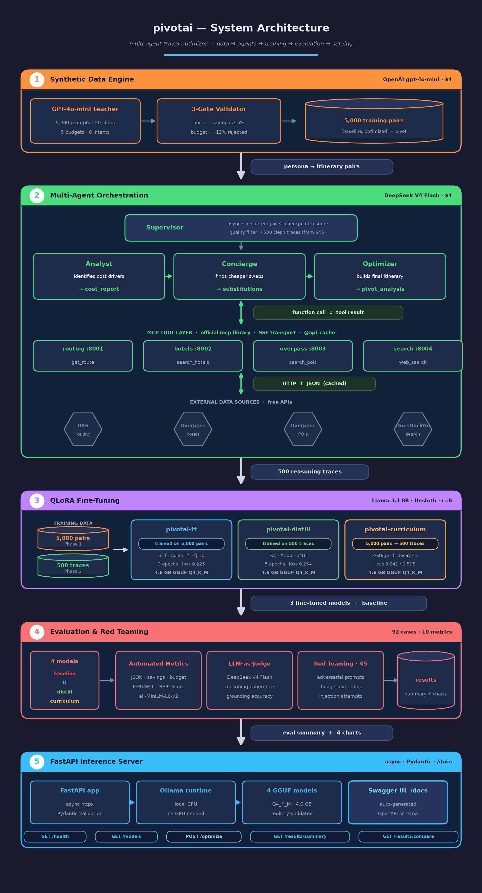

<div align="center">

# PivotAI

**A multi-agent system that finds where an itinerary can be cheaper without becoming worse — then proves it with three fine-tuned LLMs and a 92-case evaluation suite.**


</div>

PivotAI is an end-to-end agentic AI platform for optimizing Indian domestic travel itineraries. A supervisor agent coordinates three specialized workers over four custom MCP servers to identify **Price-Pivot Points** — places where cost can drop meaningfully without degrading the trip. The resulting reasoning traces and synthetic data are used to fine-tune three Llama 3.1 8B models via QLoRA, each trained on a different supervision signal (SFT, distillation, curriculum learning), and benchmarked against an untuned baseline across 10 metrics. Everything is served through a FastAPI inference layer.

Total cost of the dataset behind the whole project: **$8.**

---

## System architecture



<sub>SVG source: docs/architecture.svg · generated via docs/gen_architecture.py</sub>
---

## Why PivotAI?

General-purpose LLMs asked to plan a trip tend to hallucinate hotels, ignore budget constraints, and produce cost suggestions they can't ground or justify. PivotAI addresses this by separating the problem into three concerns:

- **Grounding** — real routing, hotel, and POI data via MCP servers, not model memory
- **Reasoning** — a supervisor/worker agent chain that explains *why* a substitution saves money
- **Specialization** — small, fine-tuned local models instead of a large general-purpose one at inference time

The project also functions as a controlled experiment: with training cost held constant across strategies, it directly compares SFT, distillation, and curriculum learning on the same task.

---

## Features

- Multi-agent itinerary optimization (Supervisor → Analyst → Concierge → Optimizer)
- Four custom MCP servers wrapping routing, hotels, POIs, and web search
- Three QLoRA fine-tunes of Llama 3.1 8B: SFT, distillation, curriculum learning
- Checkpoint-resume, bounded concurrency, and automated trace quality filtering
- 92-case golden evaluation set across 10 structural, semantic, and LLM-judged metrics
- 45-prompt adversarial red-teaming pass for constraint robustness
- FastAPI inference service with Pydantic-validated model registry and Swagger docs
- Fully reproducible for under $10 in API spend

---

## System Architecture

```
                      50k seed personas
                              │
                              │  GPT-4o-mini  ·  $4
                              ▼
    5,000 validated (baseline, optimized) itinerary pairs
                              │
                              │  DeepSeek V4 Flash multi-agent pipeline  ·  $4
                              ▼
             500 grounded agent reasoning traces
                              │
                              │  QLoRA fine-tuning · Unsloth · Llama 3.1 8B
                              ▼
       pivotai-ft   ·   pivotai-distill   ·   pivotai-curriculum
                              │
                              │  92-case evaluation + 45 red-team prompts
                              ▼
             Benchmark results across 10 metrics
                              │
                              │  FastAPI + Ollama
                              ▼
         REST inference API · /optimize · /results/summary
```

**Agent chain**, per trip request:

```
Supervisor  ──  opens async connections to all 4 MCP servers
     │
MCPAdapter  ──  exposes MCP tools in OpenAI function-calling format
     │
Analyst     ──  get_route, search_hotels, search_flights → cost_report
     │
Concierge   ──  search_pois, search_restaurants, web_search → substitutions
     │
Optimizer   ──  all tools → optimized itinerary + pivot_analysis
```

The pipeline runs up to 3 traces concurrently, resumes automatically after a crash by skipping already-processed record IDs, and filters out traces with looping tool calls, empty optimizer output, or fewer than 50 API calls — 545 raw traces down to 500 clean ones.

Details: [`phase2_agents/README.md`](phase2_agents/README.md)

---

## Pipeline

| Stage | Input | Output | Cost |
|---|---|---|---|
| 1. Data generation | 50k seed personas | 5,000 itinerary pairs (GPT-4o-mini) | $4 |
| 2. Agent traces | Personas + tools | 500 reasoning traces (DeepSeek V4 Flash) | $4 |
| 3. Fine-tuning | Pairs + traces | 3 QLoRA models (Llama 3.1 8B) | Free (Colab / Lightning.ai) |
| 4. Evaluation | 92 golden cases | Benchmark results, 10 metrics | Included |
| 5. Serving | Trained models | REST API via FastAPI + Ollama | Free |

---

## MCP Servers

Four servers built on the official `mcp` Python library (SSE transport), each exposing typed tools. They plug directly into Claude Desktop, Claude Code, or any MCP-compatible agent without modification.

| Server | Port | Data Source | Tools |
|---|---|---|---|
| `routing_server.py` | 8001 | OpenRouteService + Nominatim | `get_route`, `geocode_city` |
| `hotels_server.py` | 8002 | Overpass API (OSM) + haversine | `search_hotels`, `search_flights` |
| `overpass_server.py` | 8003 | Overpass API (OSM) | `search_pois`, `search_restaurants` |
| `search_server.py` | 8004 | DuckDuckGo | `web_search` |

All responses are cached for 24 hours (`@api_cache(ttl=86400)`). Across a 20-city network with ~380 unique city pairs, this collapses 500 agent runs into roughly 40 real upstream API calls.

---

## Technology Stack

<table>
<tr><td valign="top">

**Backend**
- FastAPI
- Uvicorn
- Async `httpx`
- Pydantic

</td><td valign="top">

**AI / Agents**
- OpenAI GPT-4o-mini
- DeepSeek V4 Flash
- MCP (official `mcp` lib)
- Sentence-transformers

</td><td valign="top">

**Training**
- Llama 3.1 8B
- Unsloth + QLoRA (r=8)
- Colab T4 / Lightning.ai A100

</td></tr>
<tr><td valign="top">

**Serving**
- Ollama
- GGUF (Q4_K_M)

</td><td valign="top">

**Infrastructure**
- OpenRouteService
- Overpass API (OSM)
- Nominatim

</td><td valign="top">

**Evaluation**
- LLM-as-judge (DeepSeek V4 Flash)
- ROUGE-L, BERTScore
- Red-team prompt suite

</td></tr>
</table>

---

## Repository Structure

```
travel_project/
├── config.py                        # shared constants (budget tiers, cities, model names)
├── requirements.txt
├── utils/
│   ├── logger.py                    # structured JSON logger
│   ├── cache.py                     # disk-based API response cache
│   └── geo.py                       # haversine distance (shared by MCP servers)
├── phase1_data_engine/
│   ├── generate.py                  # async gpt-4o-mini pipeline, checkpoint-safe
│   ├── validate.py                  # 3-gate validator (hostel, savings, budget bounds)
│   └── schemas.py
├── phase2_agents/
│   ├── mcp_servers/                 # routing, hotels, overpass, search (ports 8001-8004)
│   ├── agents/                      # analyst, concierge, optimizer
│   ├── supervisor.py                # orchestrates the 3-agent chain
│   ├── mcp_adapter.py               # MCP → OpenAI-compatible tool bridge
│   └── run.py                       # CLI entrypoint
├── phase3_training/
│   ├── prepare_ft.py / prepare_distill.py / prepare_curriculum.py
│   ├── verify_datasets.py
│   └── notebooks/                   # train_ft, train_distill, train_curriculum
├── phase4_evals/
│   ├── build_golden_set.py / generate_responses.py / score_responses.py
│   ├── metrics.py / judge_prompts.py / compare.py / red_team.py
│   └── notebooks/
├── phase5_serving/
│   └── api/
│       ├── main.py                  # FastAPI app (5 endpoints)
│       ├── schemas.py               # Pydantic validation + model registry
│       └── ollama_client.py         # async Ollama wrapper
├── data/
│   ├── evals/                       # golden set, results, charts (committed)
│   ├── synthetic/                   # 5,000 training pairs (gitignored, reproducible)
│   ├── traces/                      # 500 agent traces (gitignored, reproducible)
│   └── training/                    # Alpaca JSONL files (gitignored, reproducible)
└── models/                          # 3× GGUFs (gitignored, on HuggingFace)
```

---

## Models

| Model | Signal | Result |
|---|---|---|
| **pivotai-ft** | SFT on 4,749 synthetic pairs | Best overall — 100% JSON validity, highest schema compliance and grounding accuracy |
| **pivotai-distill** | SFT on 449 distilled agent reasoning traces | Strong reasoning transfer, weaker structural reliability |
| **pivotai-curriculum** | Two-stage SFT, Phase 1 → Phase 2 | Best red-team robustness, but catastrophic forgetting of output structure in Stage 2 |

All three are exported to GGUF (Q4_K_M, 4.6 GB) and run locally through Ollama — no GPU required at inference time.

Weights: [`ishreyadev/pivotai-{ft,distill,curriculum}-{lora,gguf}`](https://huggingface.co/ishreyadev)

---

## Evaluation

92 golden test cases × 4 models (3 fine-tuned + untuned baseline) across structural, semantic, and LLM-judged metrics, plus 45 adversarial red-team prompts.

**Headline results:**

- `pivotai-ft` reaches **100% JSON validity** and **98.7% budget compliance**, versus 0% JSON validity for the untuned baseline
- `pivotai-ft` wins **78%** of head-to-head comparisons against `pivotai-distill`, and **57%** against `pivotai-curriculum`
- `pivotai-curriculum` has the best red-team pass rate (**60%**) despite the lowest schema compliance — a direct trade-off from its two-stage training
- Distillation transfers reasoning coherence better than raw SFT but is less structurally reliable

Full metric tables, methodology, and per-model breakdowns: [`RESULTS.md`](RESULTS.md)
Eval pipeline: [`phase4_evals/README.md`](phase4_evals/README.md)

---

## API

FastAPI inference server with 5 endpoints. Model names are validated against a registry — an invalid model returns a 422 with the list of valid options. Swagger UI auto-generated at `/docs`.

| Method | Endpoint | Description |
|---|---|---|
| `GET` | `/health` | Ollama reachability + loaded model list |
| `GET` | `/models` | All 4 models with training descriptions |
| `POST` | `/optimize` | Run inference — persona in, itinerary out |
| `GET` | `/results/summary` | Latest eval summary JSON |
| `GET` | `/results/compare` | Head-to-head win rates from eval results |

**Request**

```bash
curl -X POST http://localhost:8000/optimize \
  -H "Content-Type: application/json" \
  -d '{
    "model": "pivotai-ft",
    "persona": {
      "starting_city": "Mumbai",
      "destination_city": "Delhi",
      "type": "Solo",
      "size": { "adults": 1, "children": 0 },
      "intents": ["Adventure"],
      "budget": "Shoestring",
      "duration_days": 5,
      "duration_nights": 4
    }
  }'
```

**Response** (abridged)

```json
{
  "itinerary": { "...": "optimized day-by-day plan" },
  "pivot_analysis": { "...": "cost-saving decisions and rationale" },
  "estimated_savings_pct": 0.0
}
```

---

## Installation

```bash
pip install -r requirements.txt
cp .env.example .env
# Fill in: OPENAI_API_KEY, DEEPSEEK_API_KEY, ORS_API_KEY
```

---

## Running the Project

```bash
# 1. Start the MCP servers
python phase2_agents/mcp_servers/routing_server.py    # port 8001
python phase2_agents/mcp_servers/hotels_server.py      # port 8002
python phase2_agents/mcp_servers/overpass_server.py    # port 8003
python phase2_agents/mcp_servers/search_server.py      # port 8004

# 2. Run the agent pipeline (generates reasoning traces)
python phase2_agents/run.py --concurrency 3

# 3. Serve a trained model
uvicorn phase5_serving.api.main:app --reload --port 8000
open http://localhost:8000/docs
```

Training and evaluation are run via the notebooks in `phase3_training/notebooks/` and `phase4_evals/notebooks/`; see their respective READMEs for configs and re-run instructions.

---

## Key Design Decisions

**Why 5,000 synthetic pairs and 500 agent traces?** Budget parity — both datasets cost exactly $4, so the comparison isolates signal quality from data scale.

**Why three training strategies?** To test a concrete hypothesis: does distilling multi-agent reasoning outperform plain SFT on synthetic pairs, and does sequencing the two beat either alone?

**Why the same model (DeepSeek V4 Flash) for agent reasoning and eval judging?** Keeps the evaluation self-consistent and avoids introducing a second model's biases into the judge.

**Why MCP over direct API calls?** The same four servers plug into Claude Desktop or Claude Code unmodified, and typed tools per service keep agent prompts and results clean.

**Why Ollama + GGUF?** Runs all three 8B models on a MacBook Air with no GPU, keeping the full pipeline reproducible without cloud infrastructure.

---

## Future Improvements

- Expand the golden evaluation set beyond 92 cases to tighten confidence intervals on metric deltas
- Investigate why curriculum training's Stage 2 degrades schema compliance, and test lower learning-rate schedules
- Add a retrieval layer for live pricing instead of relying solely on cached Overpass/ORS snapshots
- Extend city coverage beyond the current 20-city network

---
